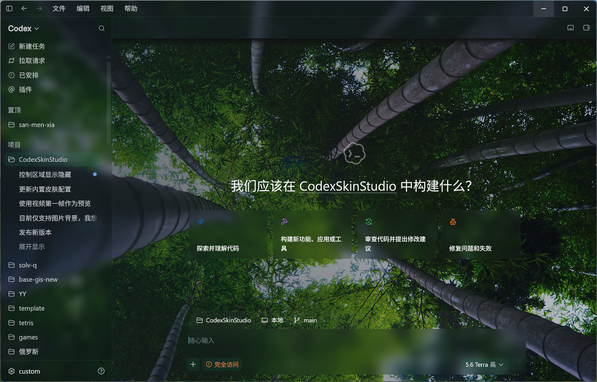

# Codex Skin Studio

<p align="center"><a href="README.md">简体中文</a> · <a href="README.en.md">English</a></p>

<p align="center">
  
</p>

<p align="center">
  <strong>Make Codex Desktop a place you can work in for the long haul.</strong><br />
  A local theme manager for Windows and macOS: import wallpaper, tune the interface, and return to the official appearance at any time.
</p>

<p align="center"><sub>This project was developed 100% with Codex.</sub></p>

<p align="center">
  <a href="#quick-start">Quick Start</a> ·
  <a href="#theme-workflows">Theme Workflows</a> ·
  <a href="#security-and-compatibility">Security &amp; Compatibility</a> ·
  <a href="#development">Development</a> ·
  <a href="#license-and-credits">License</a>
</p>

<p align="center">
  <a href="https://github.com/pojianbing/codex-skin-studio/releases"></a>
  <a href="LICENSE"></a>
  
</p>

<p align="center">
  
</p>

<p align="center">
  <sub>Theme library, live Codex preview, and an editor for individual UI elements.</sub>
</p>

> Codex Skin Studio is not an OpenAI product. It does not modify the Codex application bundle, `app.asar`, code signatures, or `config.toml`.

## Why Codex Skin Studio

Codex Skin Studio keeps themes local to your machine. Start with a built-in theme, a wallpaper, or a theme bundle, then tune the sidebar, editor, code blocks, diff view, composer, and text colors for the interface you actually work in. Changes appear immediately in the preview. Once a themed session is established, switching themes and settings does not restart Codex.

- **Build a theme from an image**: Import a JPG, PNG, or WebP wallpaper to create an editable local theme with an automatic thumbnail.
- **Tune more than the background**: Configure safe areas, task-page art, surfaces, opacity, blur, corner radius, scrollbars, diff styling, typography, and semantic colors.
- **Share the full configuration**: Import or export a single `.codex-theme` file containing the wallpaper and every theme setting.
- **Use a local theme store**: Browse, install, and update themes from a signed catalog.
- **Keep changes reversible**: Pause the current skin or restore the official appearance. Skin Studio removes injected DOM, stops its watcher, and relaunches Codex in normal mode.
- **Run it in the background**: System tray support, session recovery, and optional launch-at-login support are built in.

Two themes are included: Bamboo Skylight and Wilderness.

### Codex App Theme Results

<p align="center">
  
  
</p>

<p align="center">
  <sub>Left: Bamboo Skylight. Right: Wilderness.</sub>
</p>

## Quick Start

### 1. Install

Download the installer for your system from [GitHub Releases](https://github.com/pojianbing/codex-skin-studio/releases/latest).

| Platform | Build architectures | Codex prerequisite |
| --- | --- | --- |
| Windows | x64 | The official Codex Desktop installed from Microsoft Store |
| macOS | Apple Silicon, Intel | The official Codex / ChatGPT app in `/Applications` or `~/Applications` |

Linux is not currently supported. Skin Studio verifies the Codex installation before it performs an injection; it does nothing when the installation cannot be found or verified.

### 2. Choose and apply a theme

1. Open Codex Skin Studio and confirm that its home screen detects Codex Desktop.
2. Select a built-in theme in the **Theme Library**, or import an image or `.codex-theme` file.
3. Adjust the theme in the preview, then apply it.

The first time Skin Studio takes over a normally running Codex instance, it needs confirmation to restart Codex so it can open a local CDP port at launch. Once the themed session exists, themes and settings hot-switch without a restart.

### 3. Restore the official appearance

Choose **Restore Official Theme** in the app. Skin Studio cleans up injected content, stops its watcher, closes the verified Codex process, and restarts Codex normally. **Pause Skin** is also available when you want to temporarily disable the theme while keeping the session.

## Theme Workflows

### Start with a wallpaper

Import a local JPG, PNG, or WebP image and Skin Studio creates an independent local theme copy. The preview editor lets you control:

- Image focus, content safe area, and task-page presentation;
- Light, dark, or automatic appearance;
- Sidebar, header, thread rows, user bubbles, code blocks, activity cards, and overlays;
- Composer, environment panel, change summary, and level slider;
- Semantic text, borders, focus rings, success, warning, and error colors;
- Scrollbars, diff styling, content width, font scale, spacing, and rich-text elements.

Elements in the preview point directly to their corresponding configuration section, so you can tune readability without relying on an uncontrolled translucent layer over the whole background image.

### Import and export theme bundles

A `.codex-theme` file is a ZIP theme bundle used by Skin Studio. It contains `bundle.json` and one JPG, PNG, or WebP background image. Import validates the manifest, image format, image dimensions, and archive contents before rebuilding the thumbnail. A theme bundle never contains CDP connections, engine state, or executable code.

Theme images are limited to 16 MB, 16,384 pixels on either dimension, and 50 million pixels in total. Imported themes can be exported again for backups or sharing.

### Install from the theme store

The theme store reads its catalog from the latest stable release of [`pojianbing/codex-skin-themes`](https://github.com/pojianbing/codex-skin-themes). The client verifies an Ed25519 signature and cross-checks each download's size and SHA-256 against the verified catalog. When the network is unavailable, only the last successfully verified catalog cache is used. Themes are never installed or updated automatically.

## Security and Compatibility

Skin Studio uses the Chrome DevTools Protocol (CDP), bound to `127.0.0.1`, to inject maintained CSS and a renderer payload into a running Codex instance. It does not write to the official application directory, replace resource files, or change code signing.

- A themed session is only created for a verified official Codex process. Windows verifies the Microsoft Store package; macOS verifies the application identifier and the OpenAI signing team.
- CDP listens only on the loopback interface, but local processes under the same user account may still access the debugging port. Do not run untrusted local programs while a themed session is active.
- The current release does not modify Codex `config.toml`. Restoring the official theme leaves no persistent patch behind.
- Closing the main window hides Skin Studio in the system tray by default; choose **Quit Background Service** to exit it. When launch at login is enabled, an active theme is restored after the next login.
- Codex Desktop's internal DOM may change between versions. If an official update causes visual issues, restore the official theme first and open an issue with the app version and reproduction steps.

## Local Data

| Platform | Data directory |
| --- | --- |
| Windows | `%LOCALAPPDATA%\codex\CodexSkinStudio\data` |
| macOS | `~/Library/Application Support/studio.codex.CodexSkinStudio` |

Themes live in `themes/<theme-id>` and theme-session state is stored in `engine-state.json`. Writes use a temporary file in the same directory and a recoverable replacement strategy to avoid partial writes after an interrupted operation.

## Development

Development requires Node.js 22, Rust stable, and the [Tauri v2 prerequisites](https://v2.tauri.app/start/prerequisites/).

```powershell
npm install
npm run desktop:dev
```

Run checks, tests, and a desktop build:

```powershell
npm run lint
npm run build
cargo test --manifest-path src-tauri/Cargo.toml
npm run desktop:build
```

## Contributing and Feedback

Please use [Issues](https://github.com/pojianbing/codex-skin-studio/issues) to report bugs or suggest improvements, and feel free to submit pull requests. UI changes should be checked for readable text, focus states, and reduced-motion behavior in both light and dark themes.

## License and Credits

The application code is released under the [MIT License](LICENSE). Users are responsible for confirming their rights to use people, portraits, trademarks, and other third-party IP; the code license does not grant commercial rights to those materials.

Codex Skin Studio is not affiliated with or endorsed by OpenAI.
