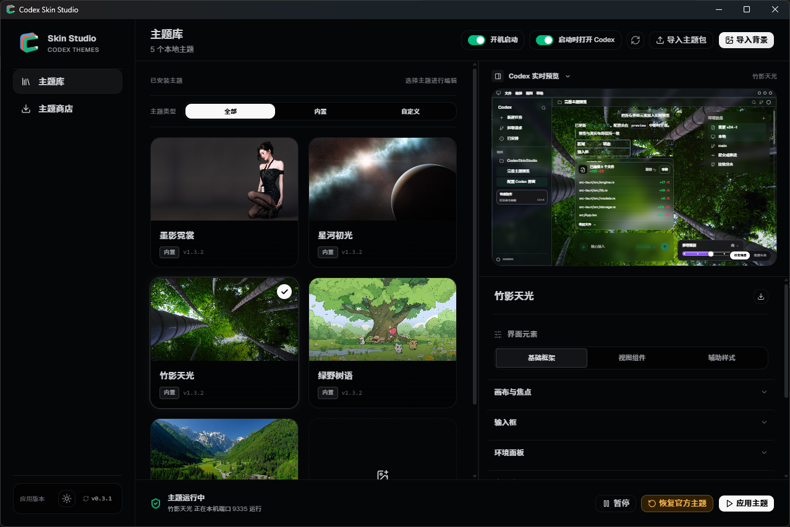

# Codex Skin Studio

<p align="center"><a href="README.md">简体中文</a> · <a href="README.en.md">English</a></p>

<p align="center">
  
</p>

<p align="center">
  <strong>把 Codex Desktop 调整成适合长期工作的界面。</strong><br />
  一个运行于 Windows 和 macOS 的本地主题管理器：导入壁纸、精细调整界面，并随时恢复官方外观。
</p>

<p align="center">
  <a href="#快速开始">快速开始</a> ·
  <a href="#主题工作流">主题工作流</a> ·
  <a href="#安全与兼容性">安全与兼容性</a> ·
  <a href="#开发">开发</a> ·
  <a href="#许可证与致谢">许可证</a>
</p>

<p align="center">
  <a href="https://github.com/pojianbing/codex-skin-studio/releases"></a>
  <a href="LICENSE"></a>
  
</p>

<p align="center">
  
</p>

<p align="center">
  <sub>主题库、Codex 实时预览与可逐项调整的编辑面板。</sub>
</p>

> 本项目不是 OpenAI 官方产品，也不会修改 Codex 的应用包、`app.asar`、代码签名或 `config.toml`。

## 为什么使用它

Codex Skin Studio 将主题保留在本机。选择内置主题、导入一张图片或加载一个主题包后，你可以针对实际工作界面调整侧栏、编辑区、代码块、差异视图、输入框和文字颜色。修改会立即反映在预览中；建立主题会话后，切换主题与参数调整无需重启 Codex。

- **以图片生成主题**：导入 JPG、PNG 或 WebP 壁纸，自动生成缩略图和一个可继续编辑的本地主题。
- **细调而非只换背景**：分别设置内容安全区、任务页背景、组件表面、透明度、模糊、圆角、滚动条、Diff、正文排版和语义颜色。
- **带上完整配置分享**：导入或导出单文件 `.codex-theme` 包，保留背景图片和所有主题参数。
- **本地主题商店**：从经过签名验证的主题目录中浏览、安装或更新主题。
- **可逆的应用过程**：暂停皮肤或恢复官方外观时，应用会移除实时注入的 DOM、停止守护并以普通模式重启 Codex。
- **适合长期运行**：支持系统托盘、会话自动恢复，以及可选的登录时后台运行。

内置 5 款主题：绿野树语、星河初光、翠谷晴峰、竹影天光和墨影霓裳。

## 快速开始

### 1. 安装

从 [GitHub Releases](https://github.com/pojianbing/codex-skin-studio/releases/latest) 下载与系统匹配的安装包。

| 平台 | 已构建架构 | Codex 前置条件 |
| --- | --- | --- |
| Windows | x64 | 通过 Microsoft Store 安装的官方 Codex Desktop |
| macOS | Apple Silicon、Intel | 位于 `/Applications` 或 `~/Applications` 的官方 Codex / ChatGPT 应用 |

Linux 当前不受支持。应用会在操作前验证检测到的 Codex 安装；找不到或无法验证时不会进行注入。

### 2. 选择主题并应用

1. 启动 Codex Skin Studio，确认首页显示已检测到 Codex Desktop。
2. 在「主题库」中选择一个内置主题，或点击导入按钮选择自己的图片或 `.codex-theme` 文件。
3. 在预览中调整主题，再点击应用。

首次将一个普通模式运行的 Codex 接入主题时，应用需要确认后重启 Codex，以便在启动时打开本机 CDP 端口。主题会话建立后，主题和参数均可热切换。

### 3. 恢复官方外观

在应用中选择「恢复官方主题」。Skin Studio 会清理已注入的内容、停止 watcher、关闭已验证的 Codex 进程，并正常重新启动 Codex。也可使用「暂停皮肤」临时关闭主题而保留当前会话。

## 主题工作流

### 从壁纸开始

导入本地 JPG、PNG 或 WebP 后，应用会创建一个独立的本地主题副本。通过预览编辑器可调整：

- 图片焦点、内容安全区及任务页显示方式；
- 浅色、深色或自动外观；
- 侧栏、顶部栏、会话行、用户气泡、代码块、活动卡片和弹层；
- 输入框、环境面板、变更摘要和等级滑块；
- 文本、边框、焦点环、成功、警告和错误等语义颜色；
- 滚动条、Diff 样式、内容宽度、字号、间距和富文本元素。

预览中的组件可直接定位到对应配置区，便于只调整影响阅读体验的部分，而不是在整张背景图上叠加不可控的透明层。

### 导入与导出主题包

`.codex-theme` 是 Skin Studio 使用的 ZIP 主题包，包含 `bundle.json` 及一张 JPG、PNG 或 WebP 背景图。导入时会验证清单、图片格式、尺寸和压缩包内容，并重新生成缩略图；主题包不会携带 CDP 连接、引擎状态或可执行代码。

主题图片最大为 16 MB，最大边长为 16,384 像素，最大像素数为 5,000 万。导入的主题可再次导出，用于备份或分享。

### 从主题商店安装

主题商店从 [`pojianbing/codex-skin-themes`](https://github.com/pojianbing/codex-skin-themes) 的最新正式 Release 获取目录。客户端会校验 Ed25519 签名，并将下载包的大小和 SHA-256 与已验证目录交叉核对。网络不可用时仅使用上一次验证成功的目录缓存；不会自动安装或自动更新主题。

## 安全与兼容性

Skin Studio 通过绑定到 `127.0.0.1` 的 Chrome DevTools Protocol (CDP) 将统一维护的 CSS 与 renderer payload 注入正在运行的 Codex。它不写入官方应用目录，不替换资源文件，也不修改 Code Signing。

- 应用只会对已验证的官方 Codex 进程建立主题会话。Windows 验证 Microsoft Store 包；macOS 验证应用标识和 OpenAI 签名团队。
- CDP 只监听回环地址，但同一用户账户下的本地进程仍可能访问调试端口。主题会话运行时，请不要执行不可信的本机程序。
- 当前版本不会修改 Codex 的 `config.toml`。恢复官方主题不会留下持久化补丁。
- 关闭主窗口默认会最小化到系统托盘；选择「退出后台」才会退出 Skin Studio。启用登录时后台运行后，活动主题会在下次登录后恢复。
- Codex Desktop 的内部 DOM 可能随版本变化。若官方更新导致界面异常，请先恢复官方主题并在 Issue 中附上版本与复现信息。

## 本地数据

| 平台 | 数据目录 |
| --- | --- |
| Windows | `%LOCALAPPDATA%\codex\CodexSkinStudio\data` |
| macOS | `~/Library/Application Support/studio.codex.CodexSkinStudio` |

主题位于 `themes/<theme-id>`，主题会话状态位于 `engine-state.json`。写入采用同目录临时文件与可恢复替换，避免中断操作留下半写入状态。

## 开发

开发环境需要 Node.js 22、Rust stable，以及 [Tauri v2 的系统依赖](https://v2.tauri.app/start/prerequisites/)。

```powershell
npm install
npm run desktop:dev
```

执行检查、测试与桌面构建：

```powershell
npm run lint
npm run build
cargo test --manifest-path src-tauri/Cargo.toml
npm run desktop:build
```

## 贡献与反馈

欢迎通过 [Issues](https://github.com/pojianbing/codex-skin-studio/issues) 报告问题、提出建议或提交 Pull Request。提交界面相关改动时，请同时验证浅色和深色主题下的文字可读性、焦点状态和 reduced-motion 行为。

## 许可证与致谢

项目代码采用 [MIT License](LICENSE)。内置主题素材来自 [Fei-Away/Codex-Dream-Skin](https://github.com/Fei-Away/Codex-Dream-Skin) 的 MIT 许可预设；人物、肖像、商标及其他第三方 IP 的使用权需要由主题使用者自行确认，代码许可证并不自动授予相应的商业使用权。

Codex Skin Studio 与 OpenAI 没有关联、也未经其认可。
